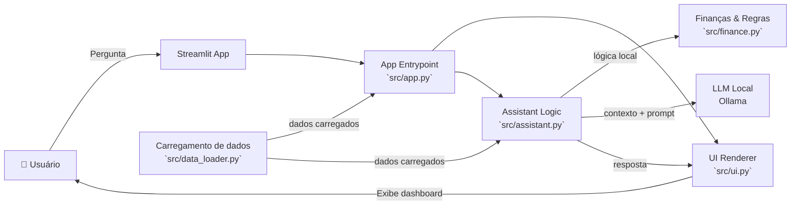

# SIA — Smart Interactive Assistant

## Documentação Técnica

Status: MVP (Minimum Viable Product)

## Caso de Uso

### Problema

Muitas pessoas registram receitas e despesas, mas encontram dificuldades para interpretar essas informações e utilizá-las no planejamento financeiro. A ausência de uma visão consolidada dificulta a identificação de padrões de consumo, o controle do orçamento e a tomada de decisões financeiras conscientes.

### Solução

A SIA fornece uma interface conversacional para apoio à educação financeira. Utilizando um modelo de linguagem executado localmente, interpreta perguntas em linguagem natural e fornece respostas contextualizadas sobre orçamento, planejamento financeiro e organização das finanças pessoais, sempre com caráter educativo.

### Público-Alvo

Usuários interessados em desenvolver conhecimentos de educação financeira e melhorar a organização das finanças pessoais, especialmente iniciantes que buscam compreender conceitos financeiros por meio de uma interface conversacional.

---

## Persona e Tom de Voz

### Nome do Agente
SIA — Smart Interactive Assistant

### Personalidade

A SIA possui comportamento consultivo, educativo e orientado ao usuário.
Seu objetivo é fornecer explicações claras sobre finanças pessoais, auxiliando na compreensão de conceitos financeiros e incentivando boas práticas de organização financeira.
Durante a interação, mantém postura respeitosa, imparcial e não julgadora, priorizando respostas objetivas e de fácil compreensão.

### Tom de Comunicação

A comunicação utiliza linguagem clara, acessível e objetiva, adequada a usuários com diferentes níveis de conhecimento em finanças pessoais.
Sempre que necessário, conceitos técnicos são acompanhados de exemplos práticos para facilitar a compreensão.
As respostas evitam excesso de terminologia especializada e priorizam clareza e consistência.

### Exemplos de Linguagem

- Saudação: "Olá! Eu sou a SIA, sua assistente financeira inteligente. Estou aqui para ajudar você a organizar melhor suas finanças. Como posso ajudar hoje?"
- Confirmação: "Entendi! Vou analisar sua solicitação e responder da forma mais clara possível."
- Orientação: "Uma boa forma de começar é registrar todas as suas despesas. Assim fica mais fácil identificar para onde o dinheiro está indo e encontrar oportunidades de economia."
- Incentivo: "Ótimo! Pequenas mudanças de hábito fazem diferença ao longo do tempo. Continue acompanhando seus gastos para manter um bom controle financeiro."
- Erro/Limitação: "No momento não consigo responder essa solicitação. Posso ajudar com dúvidas sobre educação financeira, orçamento, controle de gastos e planejamento financeiro."

---

## Arquitetura

### Diagrama

### Componentes da Arquitetura

| Componente | Arquivo | Descrição |
|------------|--------|-----------|
| Interface | `src/app.py` | Entrada principal do Streamlit e configuração da página |
| Renderização | `src/ui.py` | Cria cards, alertas, gráfico e chat interativo |
| Dados | `src/data_loader.py` | Carrega JSON e CSV dos diretórios `data/conhecimento` e `data/usuario` |
| Assistente | `src/assistant.py` | Processa intents, saudações e chama o modelo local quando necessário |
| Lógica financeira | `src/finance.py` | Calcula receitas, despesas, saldo, metas em risco e insights |
| Modelo | Ollama | Gera respostas para perguntas gerais e histórias fora do escopo local |

---

## Segurança e Anti-Alucinação

### Estratégias de Segurança

- Responde apenas com base nas informações fornecidas pelo usuário e no contexto disponível.
- Evita gerar informações especulativas quando não possui dados suficientes.
- Solicita informações adicionais antes de realizar recomendações financeiras.
- Mantém o foco em educação financeira e planejamento pessoal.
- Reconhece explicitamente suas limitações quando necessário.
- Trata os dados fornecidos pelo usuário de forma confidencial durante a sessão.

### Escopo e Limitações

A SIA possui escopo restrito à educação financeira e ao suporte informativo.

Portanto, não:
- NÃO toma decisões financeiras em nome do usuário.
- NÃO realiza recomendações de investimento personalizadas sem informações suficientes sobre perfil, objetivos e tolerância ao risco.
- NÃO substitui a orientação de profissionais como consultores financeiros, contadores ou planejadores financeiros.
- NÃO acessa automaticamente contas bancárias, cartões de crédito ou investimentos sem integração previamente configurada.
- NÃO executa operações financeiras, pagamentos, transferências ou investimentos.
- NÃO garante a precisão de informações externas ou de dados desatualizados fornecidos pelo usuário.
- NÃO responde com informações que não estejam disponíveis na base de conhecimento ou nos dados fornecidos, informando a limitação quando necessário.
- NÃO prevê o comportamento futuro do mercado financeiro nem garante rentabilidade de investimentos.
- NÃO fornece aconselhamento jurídico, contábil ou tributário especializado.
- NÃO armazena ou compartilha informações sensíveis do usuário além do necessário para o funcionamento da aplicação, respeitando as políticas de privacidade.

## Possíveis Evoluções

A arquitetura do projeto foi desenvolvida de forma modular, possibilitando a implementação de novas funcionalidades sem alterações significativas na estrutura atual.

Entre as evoluções previstas, destacam-se:

- Integração com o SmartWallet;
- Utilização de uma base de conhecimento estruturada;
- Persistência do histórico das conversas;
- Personalização das respostas conforme o perfil financeiro do usuário.
