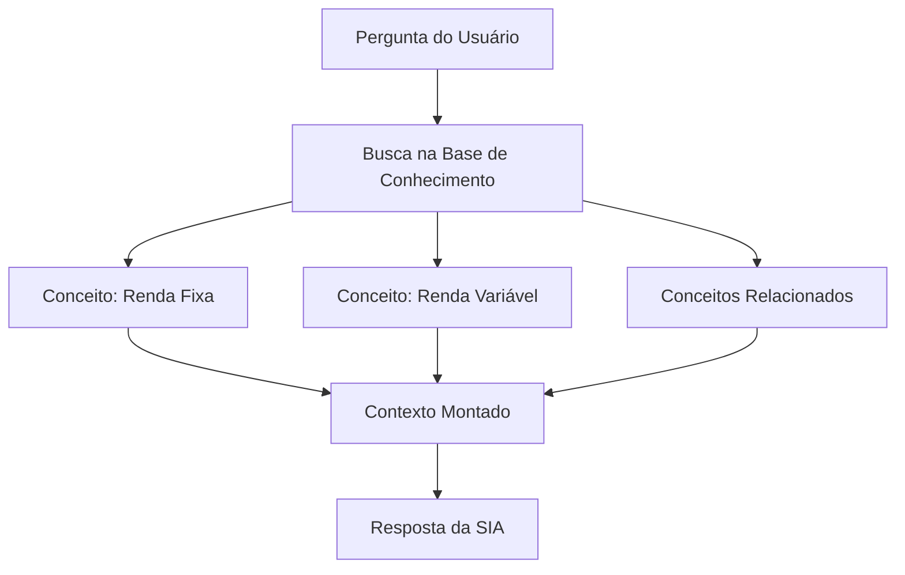

# Base de Conhecimento

## Dados Utilizados

A SIA utiliza uma base de conhecimento estruturada em arquivos JSON para fornecer respostas sobre educação financeira. Além disso, arquivos CSV são utilizados como dados de exemplo para simular cenários de uso e testes da aplicação.


| Arquivo                      | Formato | Utilização no Agente                                                                                                                           |
| ---------------------------- | ------- | ---------------------------------------------------------------------------------------------------------------------------------------------- |
| `conceitos_financeiros.json` | JSON    | Base de conceitos de educação financeira, utilizada para responder perguntas sobre orçamento, investimentos, crédito e indicadores econômicos. |
| `perfil_investidor.json`     | JSON    | Contém os perfis de investidor (conservador, moderado e arrojado), utilizados para contextualizar respostas relacionadas a investimentos.      |
| `produtos_financeiros.json`  | JSON    | Armazena informações sobre produtos financeiros, como poupança, CDB, Tesouro Selic, LCI, LCA, ETFs e ações.                                    |
| `perguntas_frequentes.json`  | JSON    | Reúne perguntas frequentes e seus respectivos conceitos relacionados, auxiliando na geração de respostas rápidas e consistentes.               |
| `historico_atendimento.csv`  | CSV     | Utilizado como dados de histórico de atendimento para resumo de interações e avaliação de temas recorrentes.                                  |
| `transacoes.csv`             | CSV     | Contém exemplos de transações financeiras para demonstração, cálculo de receitas/despesas e geração de insights.                             |

---

## Adaptações nos Dados

Os arquivos foram organizados em duas pastas distintas:
- `data/conhecimento` para a base de conhecimento (JSON);
- `data/usuario` para dados de exemplo do usuário (CSV e JSON).

Essa separação melhora a manutenção e permite atualizar os conceitos financeiros independentemente das transações ou metas do usuário.

---

## Estratégia de Integração

### Como os dados são carregados?

A base de conhecimento da SIA é carregada por `src/data_loader.py`, que utiliza `pandas` e `pathlib` para ler os arquivos armazenados em `data/conhecimento` e `data/usuario`.

Os dados ficam disponíveis em memória durante a execução da aplicação, reduzindo leituras repetidas de disco e acelerando o fluxo de atendimento.

#### Exemplo de carregamento dos arquivos

```python
from pathlib import Path
import pandas as pd

ROOT_DIR = Path(__file__).resolve().parents[1]
CONHECIMENTO_DIR = ROOT_DIR / "data" / "conhecimento"
USUARIO_DIR = ROOT_DIR / "data" / "usuario"

conceitos = pd.read_json(CONHECIMENTO_DIR / "conceitos_financeiros.json")
perfis = pd.read_json(CONHECIMENTO_DIR / "perfil_investidor.json")
produtos = pd.read_json(CONHECIMENTO_DIR / "produtos_financeiros.json")
faq = pd.read_json(CONHECIMENTO_DIR / "perguntas_frequentes.json")
transacoes = pd.read_csv(USUARIO_DIR / "transacoes.csv")
historico = pd.read_csv(USUARIO_DIR / "historico_atendimento.csv")
metas = pd.read_json(USUARIO_DIR / "metas_financeiras.json")

print("Base de conhecimento carregada com sucesso.")
```
### Como os dados são usados no prompt?

Os dados carregados a partir da base de conhecimento são utilizados para fornecer contexto às respostas geradas pela SIA.

Quando o usuário realiza uma pergunta, a aplicação pode identificar os conceitos, perfis de investidor, produtos financeiros ou perguntas frequentes relacionados ao tema consultado. Essas informações são então utilizadas para compor o contexto enviado ao modelo de linguagem.

Dessa forma, o modelo recebe informações estruturadas sobre o assunto antes de gerar a resposta, aumentando a consistência das respostas e reduzindo a dependência do conhecimento geral do modelo.

Essa estratégia também favorece a escalabilidade da solução, pois novos conceitos, produtos ou categorias podem ser adicionados à base de conhecimento sem necessidade de alterações significativas na lógica do agente.

---

## Exemplo de Contexto Montado

Este exemplo ilustra como a base de conhecimento pode ser utilizada para recuperar informações relevantes e construir o contexto enviado ao modelo de linguagem.

### Fluxo de Recuperação



### Entrada

**Pergunta do usuário**

> Qual a diferença entre renda fixa e renda variável?

### Informações Recuperadas

| Conceito | Informações Recuperadas |
|-----------|------------------------|
| **Renda Fixa** | Investimentos cuja remuneração segue regras previamente definidas. Geralmente apresentam menor exposição às oscilações do mercado e maior previsibilidade de retorno. |
| **Renda Variável** | Investimentos cujo retorno depende das condições e oscilações do mercado. Possuem maior potencial de rentabilidade, acompanhado de maior risco. |
| **Conceitos Relacionados** | Liquidez, Risco e Perfil do Investidor. |

### Contexto Enviado ao Modelo

```text
Conceito: Renda Fixa
- Investimentos cuja remuneração segue regras previamente definidas.
- Geralmente apresentam menor exposição às oscilações do mercado e maior previsibilidade de retorno.

Conceito: Renda Variável
- Investimentos cujo retorno depende das condições e oscilações do mercado.
- Possuem maior potencial de rentabilidade, acompanhado de maior risco.

Conceitos relacionados:
- Liquidez
- Risco
- Perfil do Investidor
```

### Objetivo

A partir desse contexto, o modelo de linguagem pode gerar respostas alinhadas à base de conhecimento da SIA.

Nesse processo, as informações recuperadas da base de conhecimento são utilizadas como apoio para a geração da resposta. Isso permite que o agente utilize conceitos financeiros previamente definidos, mantendo maior consistência nas orientações fornecidas ao usuário.

Além disso, a utilização de contexto específico reduz a necessidade de incluir toda a base de conhecimento em cada interação, tornando a solução mais eficiente e preparada para futuras expansões.

### Exemplo de Resposta Esperada

> A principal diferença entre renda fixa e renda variável está na previsibilidade dos retornos e no nível de risco envolvido.
>
> Na renda fixa, as regras de remuneração são definidas no momento da aplicação, oferecendo maior previsibilidade e menor exposição às oscilações do mercado. Exemplos incluem Poupança, Tesouro Selic, CDB, LCI e LCA.
>
> Já na renda variável, os resultados dependem do desempenho do mercado e podem variar ao longo do tempo. Embora exista potencial para retornos mais elevados, os riscos também tendem a ser maiores. Exemplos incluem ações e ETFs.
>
> A escolha entre renda fixa e renda variável deve considerar fatores como objetivos financeiros, horizonte de investimento, necessidade de liquidez e perfil do investidor.